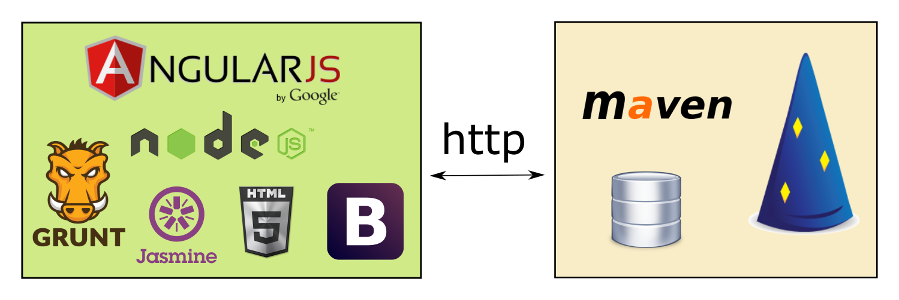

                       Angular JS

                       2015-04-16


             kris-mikael.krister@webstep.no


- git clone https://github.com/kmkr/angular-ws.git
- git pull origin master (if your cloned repo is old)
- Install nodejs
- Run "npm install -g grunt-cli" (in a shell, cmd, prompt)
- Run "npm install" in "angular-ws" folder
- Run "grunt serve" in folder "angular-ws"
- Optional: run guestbook-backend (dropwizard)


# Agenda

- History
- Overview of the concepts in Angular
- Code examples
- Hands-on (guestbook-client)
    - Module
    - Controller
    - Service
    - Routing
    * Directive
    * Unit testing with Karma and Jasmine
- Angular 2.x


# History

     0.9.0 -------- 1.0.0 -------- 1.3.15

     2010           2012           2015


# Angular

- Framework for building Single-page webapps
- MV*
- Two-way databinding via _scopes_
- Templating with _expressions_
- Dependency injection
- Ajax-abstraction (`$http`)
- Routing


# Angular code examples

1. Expressions
    - forgiving
    - filters/string og ng-model
    - context
    - no loops/exceptions allowed

2. Controller
    - scope
    - ng-click
    - ng-submit
    - filters/function

3. Service
    - dependency injection

4. Directive
    - scope
    - template


# Guestbook-client




## Module

Collection of components

Examples:

- Components that, together, solve problem X
- Components that, together, offer feature Y

```javascript
angular.module('guestbookApp', [
    'guestbooksModule',
    'entriesModule'
]);
```


## Controller

- Connects view and business logic
- No DOM-manipulation allowed


`guestbooks/guestbooks-controller.js`

```javascript
angular.module('guestbooksModule')
.controller('GuestbooksController', function () {
    this.guestbooks = [
        { id: 1, name: 'A guestbook' },
        { id: 2, name: 'Another guestbook' }
    ]
});
```


### Task 1: List guestbooks

Show a list of guestbooks

Tips:

1. Use new module "guestbookModule"
2. Each module should use a separate folder. Example: "/guestbooks"
3. For now, use a hardcoded array (list of guestbooks)
4. Expose the array to the template from the controller
5. Remember `ng-app="guestbookApp"` in `index.html`
6. Remember adding dependency "guestbookModule" to "guestbookApp"

7. HTML-snippet from `index.html`:


```html
<div ng-controller="GuestbooksController as guestbooksCtrl">
    <!-- content -->
</div>
```


7. Use `ng-repeat` to write the name of each guestbook:

```html
<ul>
    <li ng-repeat="guestbook in guestbooksCtrl.guestbooks">
        {{guestbook.name}}
    </li>
</ul>
```


## Service

- View-independent business logic
- Testable
- Reusable


`guestbooks/guestbook-service.js`

```javascript
angular.module('guestbooksModule')
.service('GuestbookService', function ($http) {
    this.get = function () {
        return $http.get('/guestbook/list')
            .then(function (response) {
                return response.data;
            });
    };
});
```


### Task 2: Fetch guestbooks asynchronously

1. Add a `GuestbookService`
2. Use Angular's `$http`-service to fetch data (instead of hardcoded array)
3. Use dependency injection to get the `GuestbookService` instance from the controller
4. Don't forget that the async service methods returns a _promise_
5. You can choose whether to use mock data or a backend
6. You will have to change `ng-app` if you're using mock data:
    - `ng-app="guestbookAppMock"`

Didn't finish task 1? Run:

`git stash -u`
`git checkout task_2`


`test/mock/guestbook-app-mock.js`

```javascript
angular.module('guestbookAppMock', ['guestbookApp', 'ngMockE2E'])
    .run(function ($httpBackend) {
        $httpBackend.whenGET('/guestbook/list').respond([
            {
                id: 1,
                name: 'My guestbook'
            },
            {
                id: 2,
                name: 'My other guestbook'
            }
        ]);
        $httpBackend.whenGET(/.*/).passThrough();
        $httpBackend.whenPOST(/.*/).passThrough();
    });
```


## Service 2 - POST

`$http.post(url, data)`


### Task 3: Create new guestbooks

Create new guestbooks from the view

Hint:

1. Use the HTML <form> element in `index.html`
2. Use `ng-submit`
3. Remember `<button type="submit">My button</button>`
4. Extend `GuestbookService` with a method `create()` that sends data. See "Create" in README.md for details.
5. You can choose whether to use mock data or a backend. URI is POST: '/guestbook'
6. Update guestbook array in controller on success

Didn't finish task 2? Run:

`git stash -u`
`git checkout task_3`


`index.html`

```html
<!-- more -->
<form ng-submit="guestbooksCtrl.create()">
    <div class="form-group">
        <label>
            Name
            <input ng-model="guestbooksCtrl.newGuestbook.name" />
        </label>
    </div>
    <button type="submit">Create</button>
</form>
<!-- more -->
```


`guestbooks/guestbook-service.js`

```javascript
angular.module('guestbooksModule')
.service('GuestbookService', function ($http) {
    this.get = // ...

    this.create = function (guestbook) {
        return $http.post('/guestbook', guestbook);
    };
});
```


`guestbooks/guestbooks-controller.js`

```javascript
angular.module('guestbooksModule')
.controller('GuestbooksController', function (GuestbookService) {
    var ctrl = this;

    // ...

    this.create = function () {
        GuestbookService.create(ctrl.newGuestbook)
            .then(function () {
                ctrl.guestbooks.push(ctrl.newGuestbook);
                delete ctrl.newGuestbook;
            });
    };
});
```


## Routing


- HTML5 mode (`/my-route`) or hash (`/#my-route`)
- Own module/JavaScript file `angular-route` (already included in `index.html`)


`guestbook-routing.js`

```javascript
angular.module('guestbookApp')
.config(['$routeProvider', function ($routeProvider) {
        $routeProvider
        .when('/guestbooks', {
            templateUrl: 'guestbooks/guestbooks.html',
            controller: 'GuestbooksController',
            controllerAs: 'guestbooksCtrl'
        })
        .otherwise({
            redirectTo: '/guestbooks'
        });
    }
]);
```


### Task 4: Use routing

Move guestbook view to own template and route

Tips:

1. Create a template of the guestbook view in `guestbooks/guestbooks.html`
2. Remember `<ng-view></ng-view>` i `index.html`
3. Create file `guestbook-routing.js` with route config (see above)


Didn't finish task 3? Run:

`git stash -u`
`git checkout task_4`


## Routing 2 - resolving data


```javascript
// ..
.when('/guestbooks', // ...)
.when('/guestbooks/:id', {
    templateUrl: 'entries/entries.html',
    controller: 'EntriesController',
    controllerAs: 'entriesCtrl',
    resolve: {
        entries: function (EntryService, $route) {
            return EntryService.get($route.current.params.id);
        }
    }
})
.otherwise(//...)
```


### Task 5: Implement "entries"

1. Use folder "entries" and module "entriesModule"
2. Entries are connected to a guestbook instance, create a `service` to fetch entries
3. You can choose whether to use mock data or a backend. URI is: `/guestbook/{guestbookId}/entries`
4. Configure a new route for `EntriesController`
5. Create `EntriesController` and inject `entries` by using `resolve`

6. Extend `guestbooks.html` with a link for each guestbook

```html
<a ng-href="#guestbooks/{{guestbook.id}}">
    {{guestbook.name}}
</a>
```


Didn't finish task 4? Run:

`git stash -u`
`git checkout task_5`


## Directive

- Reusable view components
- DOM manipulation allowed

`entries/entry-directive.js`

```javascript
angular.module('entriesModule')
.directive('entry', function () {
    return {
        link: function (scope) {
            console.log('Hello from ', scope.entry);
        },
        templateUrl: 'entries/entry.html',
        scope: {
            'entry': '='
        }
    };
});
```

`entries/entry.html`

```html
<div>
    <h2>{{entry.name}}</h2>

    <p>{{entry.message}}</p>
</div>
```


### Task 6: "Entry" as a directive

An entry contains a "name" and a "message". Create a directive to show an entry. Print each entry.

Tip:

1. Use `ng-repeat` to loop over entries.
2. Check out [the directive documentation] [1]

Didn't finish task 5? Run:

`git stash -u`
`git checkout task_6`

```html
<ul>
    <li ng-repeat="entry in entriesController.entries">
        <div entry="entry"></entry>
    </li>
</ul>
```

[1]: https://docs.angularjs.org/guide/directive


### Task 7: Update entry

Update status for an entry through the view


Tips:

1. Updates via PUT to URI `/guestbook/{guestBookId}/entry/{id}/{status}`
2. Extend `entry.html` with a form
3. Expose a list of status options from EntryDirective
4. Use the `ngOptions` directive to show the status options
5. Check out the documentation for [ngOptions] [2]
6. Extend `EntriesService` with an update method
7. Expose an `update()` function in the directive that delegates to the service
8. Call `update()` via a form `<button>`

[2]: https://docs.angularjs.org/api/ng/directive/ngOptions

```javascript
angular.module('entriesModule')
.directive('entry', function (EntriesService) {
    return {
        link: function (scope) {
            scope.update = function () {
                EntriesService.update(scope.entry)
                    .then(function (response) {
                        alert('Successfully updated!');
                    })
                    .catch(function (err) {
                        alert('Oh no!');
                    });
            }
        },
        templateUrl: 'entries/entry.html',
        scope: {
            'entry': '='
        }
    };
});
```


Didn't finish task 6? Run:

`git stash -u`
`git checkout task_7`


## Additional tasks


1. Write Jasmine-tests for `guestbook-service.js`, use `guestbook-app-test.js` as an example
2. Implement _closing_ of guestbooks. See "Close" in `README.md`
3. Write Jasmine-tests for `entry-directive.js`. See "Testing directives" in [Angular's documentation for unit testing] [3]

[3]: https://docs.angularjs.org/guide/unit-testing


# More of Angular's concepts

- Factory
- Provider
- Constant
- Integration testing with Protractor
- Animations (ngAnimate)
- Multiple Angular apps on the same site
- I18n (angular-i18n)


# Angular's future

Angular 2

- ATScript
- (Significant) API changes
- Performance improvements
- Improved routing
- Modularization


