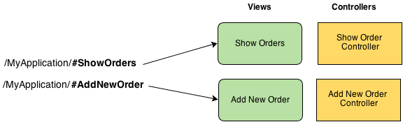

                       Angular JS

                       2015-04-16


             kris-mikael.krister@webstep.no


    git clone https://github.com/kmkr/angular-ws.git


# Agenda

- Historie
- Oversikt over Angulars konsepter
- Kodeeksempler
- Hands-on (guestbook-klient)
    - Module
    - Controller
    - Service
    - Routing
    * Directive
    * Unit testing med Karma og Jasmine
- Angular 2.x


# Historie

     0.9.0 -------- 1.0.0 -------- 1.3.15

     2010           2012           2015


# Angular

- Rammeverk for single-page webapps
- MV*
- Two-way databinding via _scopes_
- Templating med _expressions_
- Dependency injection
- Ajax-abstraksjon (`$http`)
- Routing


# Angular kodeeksempler

1. Expressions
    - forgiving
    - filters/string og ng-model
    - context
    - ingen loops/exceptions

2. Controller
    - scope
    - ng-click
    - ng-submit
    - filters/function

3. Service
    - dependency injection

4. Directive
    - scope
    - template


# Guestbook-klient


## Modul

Gruppering av komponenter

Typisk gruppering:

- Komponenter som tilsammen løser problem X
- Komponenter som tilbyr feature Y

```javascript
angular.module('guestbookApp', [
    'guestbooksModule',
    'entriesModule'
]);
```


## Controller

- Knytning mellom view og business-logikk
- Ingen DOM-manipulering i controllers


`guestbooks/guestbooks-controller.js`

```javascript
angular.module('guestbooksModule')
.controller('GuestbooksController', function () {
    this.guestbooks = [
        { id: 1, name: 'A guestbook' },
        { id: 2, name: 'Another guestbook' }
    ]
});
```


### Oppgave 1: Guestbook-liste

Vis en liste av guestbooks

Hint/tips:

1. Bruk ny modul "guestbookModule"
2. Hver modul bør ha en egen mappe, eks: "/guestbooks"
3. Bruk hardkodet array med guestbooks
4. Eksponer liste til template fra controller
5. Husk `ng-app="guestbookApp"` i `index.html`
6. Husk å legge på avhengighet til "guestbookModule" fra "guestbookApp"

7. HTML-snippet fra `index.html`:


```html
<div ng-controller="GuestbooksController as guestbooksCtrl">
    <!-- innhold -->
</div>
```


7. Bruk `ng-repeat` til å skrive ut navn på hver guestbook:

```html
<ul>
    <li ng-repeat="guestbook in guestbooksCtrl.guestbooks">
        {{guestbook.name}}
    </li>
</ul>
```


## Service

- View-uavhengig business-logikk
- Enkelt å teste
- Gjør det lettere å følge single-responsibility-principle


`guestbooks/guestbook-service.js`

```javascript
angular.module('guestbooksModule')
.service('GuestbookService', function ($http) {
    this.get = function () {
        return $http.get('/guestbook/list')
            .then(function (response) {
                return response.data;
            });
    };
});
```


### Oppgave 2: Hent guestbooks asynkront

1. Innfør `GuestbookService` til å hente data (i stedet for hardkodet array)
2. Utnytt angulars `$http`-service
3. Utnytt dependency injection til å få tak i `GuestbookService` fra controller
4. Husk at service returnerer et _promise_
5. Velg selv om du bruker mockdata eller backend
6. Hvis du bruker mockdata må du endre `ng-app`

Rakk du ikke oppgave 1? Kjør:

`git stash -u`
`git checkout task_2`


`test/mock/guestbook-app-mock.js`

```javascript
angular.module('guestbookAppMock', ['guestbookApp', 'ngMockE2E'])
    .run(function ($httpBackend) {
        $httpBackend.whenGET('/guestbook/list').respond([
            {
                id: 1,
                name: 'My guestbook'
            },
            {
                id: 2,
                name: 'My other guestbook'
            }
        ]);
        $httpBackend.whenGET(/.*/).passThrough();
        $httpBackend.whenPOST(/.*/).passThrough();
    });
```


## Service 2 - POST

`$http.post(url, data)`


### Oppgave 3: Opprett nye guestbooks

Implementer mulighet til å opprette nye guestbooks

Hint:

1. Bruk et vanlig HTML-form i `index.html` med `ng-submit`
2. Husk `<button type="submit">My button</button>`
3. Utvid `GuestbookService` med en metode `create()` som sender til backend. Se "Create" i README.md
4. Konfigurer mock for POST til `/guestbook`
5. Oppdater intern guestbook-struktur i controller ved suksess

Rakk du ikke oppgave 2? Kjør:

`git stash -u`
`git checkout task_3`


`index.html`

```html
<!-- more -->
<form ng-submit="guestbooksCtrl.create()">
    <div class="form-group">
        <label>
            Navn
            <input ng-model="guestbooksCtrl.newGuestbook.name" />
        </label>
    </div>
    <button type="submit">Opprett</button>
</form>
<!-- more -->
```


`guestbooks/guestbook-service.js`

```javascript
angular.module('guestbooksModule')
.service('GuestbookService', function ($http) {
    this.get = // ...

    this.create = function (guestbook) {
        return $http.post('/guestbook', guestbook);
    };
});
```


`guestbooks/guestbooks-controller.js`

```javascript
angular.module('guestbooksModule')
.controller('GuestbooksController', function (GuestbookService) {
    var ctrl = this;

    // ...

    this.create = function () {
        GuestbookService.create(ctrl.newGuestbook)
            .then(function () {
                ctrl.guestbooks.push(ctrl.newGuestbook);
                delete ctrl.newGuestbook;
            });
    };
});
```


## Routing



- HTML5 (`/my-route`) eller hash (`/#my-route`)
- Egen modul/JavaScript-fil `angular-route`


`guestbook-routing.js`

```javascript
angular.module('guestbookApp')
.config(['$routeProvider', function ($routeProvider) {
        $routeProvider
        .when('/guestbooks', {
            templateUrl: 'guestbooks/guestbooks.html',
            controller: 'GuestbooksController',
            controllerAs: 'guestbooksCtrl'
        })
        .otherwise({
            redirectTo: '/guestbooks'
        });
    }
]);
```


### Oppgave 4: Innfør routing

Flytt visning av guestbook til egen template og route

Hint:

1. Lag en template av dagens guestbook-visning: `guestbooks/guestbooks.html`
2. Husk `<ng-view></ng-view>` i `index.html`
3. Opprett fil `guestbook-routing.js` med routeoppsett (se over)


Rakk du ikke oppgave 3? Kjør:

`git stash -u`
`git checkout task_4`


## Routing 2 - resolving data


```javascript
// ..
.when('/guestbooks', // ...)
.when('/guestbooks/:id', {
    templateUrl: 'entries/entries.html',
    controller: 'EntriesController',
    controllerAs: 'entriesCtrl',
    resolve: {
        entries: function (EntryService, $route) {
            return EntryService.get($route.current.params.id);
        }
    }
})
.otherwise(//...)
```


### Oppgave 5: Innfør "entries"

1. Bruk gjerne mappe "entries" og modulen "entriesModule"
2. Entries er tilknyttet en guestbook-instans, lag en `service` for å hente entries. Bruk URI: `/guestbook/{guestbookId}/entries`
3. Sett gjerne opp mockdata, eller bruk faktisk backend
4. Konfigurer en ny route for `EntriesController`
4. Lag `EntriesController` og inject `entries` ved hjelp av resolve

5. Utvid `guestbooks.html` med en lenke for hvert element:

```html
<a ng-href="#guestbooks/{{guestbook.id}}">
    {{guestbook.name}}
</a>
```


Rakk du ikke oppgave 4? Kjør:

`git stash -u`
`git checkout task_5`


## Directive

- Gjenbrukbare view-komponenter
- Gjerne med business-logikk
- DOM-manipulering kan gjøres i directives

`entries/entry-directive.js`

```javascript
angular.module('entriesModule')
.directive('entry', function () {
    return {
        link: function (scope) {
            console.log('Hello from ', scope.entry);
        },
        templateUrl: 'entries/entry.html',
        scope: {
            'entry': '='
        }
    };
});
```

`entries/entry.html`

```html
<div>
    <h2>{{entry.name}}</h2>

    <p>{{entry.message}}</p>
</div>
```


### Oppgave 6: Lag "entry" som et directive

Vis "name" og "message" for hver entry ved hjelp av `directive` du nettopp laget

Hint:

1. Sjekk [dokumentasjon for directive] [1]

Rakk du ikke oppgave 5? Kjør:

`git stash -u`
`git checkout task_6`

```html
<ul>
    <li ng-repeat="entry in entriesController.entries">
        <div entry="entry"></entry>
    </li>
</ul>
```

[1]: https://docs.angularjs.org/guide/directive


### Oppgave 7: Oppdater entry

Oppdater status for entry


Hint:

1. Oppdatering skjer med PUT til URI `/guestbook/{guestBookId}/entry/{id}/{status}`
2. Utvid `entry.html` med en form
3. Eksponer en liste over statuser fra EntryDirective
4. Benytt `ngOptions`-directive til å vise statusene i en `<select>`.
5. Sjekk dokumentasjon for [ngOptions] [2]
6. Utvid `EntriesService` med en update-funksjon.
7. Eksponer en `update()` funksjon i directive som delegerer til service

[2]: https://docs.angularjs.org/api/ng/directive/ngOptions

```javascript
angular.module('entriesModule')
.directive('entry', function (EntriesService) {
    return {
        link: function (scope) {
            scope.update = function () {
                EntriesService.update(scope.entry)
                    .then(function (response) {
                        alert('Successfully updated!');
                    })
                    .catch(function (err) {
                        alert('Oh no!');
                    });
            }
        },
        templateUrl: 'entries/entry.html',
        scope: {
            'entry': '='
        }
    };
});
```


Rakk du ikke oppgave 6? Kjør:

`git stash -u`
`git checkout task_7`


## Ekstraoppgaver


1. Skriv jasmine-tester for `guestbook-service.js`, bruk `guestbook-app-test.js` som et utgangspunkt
2. Implementer _lukking_ av guestbook. Se "Close" i `README.md`
3. Skriv jasmine-tester for `entry-directive.js`. Se "Testing directives" i [Angulars dokumentasjon om unit testing] [3]

[3]: https://docs.angularjs.org/guide/unit-testing


# Flere av Angulars konsepter


Ting vi ikke rakk

- Factory
- Provider
- Constant
- Integrasjonstesting med Protractor
- Animasjoner (ngAnimate)
- Flere angular-apps på samme webside
- I18n (angular-i18n)


# Angular fremover

Angular 2

- ATScript
- (Vesentlige) API-endringer
- Forbedre performance
- Bedre routing
- Økt grad av modularisering


